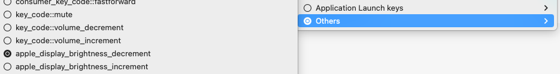

# GmuxBrightness

Restore broken screen brightness control as well as wake from sleep on old macbooks that use GMUX controller.

The app is a menubar icon displaying current brightness level. It has been tested only on MacBookPro6,2 running Ventura OCLP, but I believe it should work on any pre-retina Intel macbook.

## Requirements

0. Old macbook with broken screen brightness control (e.g. broken dGPU)
1. macOS 11+ (via [OCLP](https://dortania.github.io/OpenCore-Legacy-Patcher/))
2. [Chipsec](https://github.com/chipsec/chipsec) helper driver, available in versions until 1.11.0
3. [Karabiner](https://karabiner-elements.pqrs.org/)

## Running

### Configure Karabiner

It's far from easy to capture the standard screen brightness hotkeys in code, so we'll use Karabiner as a helper. Go to its Settings - Function Keys and map keys as follows:
- f1 -> **apple_display_brightness_decrement**
- f2 -> **apple_display_brightness_increment**

These keys are in the **Others** category:



### Run the app

First, add your terminal app (the standard Terminal, iTerm2, etc.) to **System Settings - Privacy & Security - Accessibility**. If you don't do it beforehand, the first time you run the app you'll be asked to do so, and after enabling you'll have to restart the app.

Then, run the app passing path to the Chipsec helper driver kext:

    sudo /path/to/GmuxBrightness/binary /path/to/chipsec/driver/kext

## Building

### Chipsec helper driver

Xcode project is located at `drivers/osx` directory. From the command line it can be built as:

```bash
# assuming that CWD is chipsec root directory
xcodebuild -project drivers/osx/chipsec.xcodeproj -target chipsec
```

The built kext can be found at `drivers/osx/build/Release/chipsec.kext`.

The first time the kext is attempted to be loaded, macOS will ask you to reboot. So load it manually and reboot:

    sudo kmutil load -p drivers/osx/build/Release/chipsec.kext

### The app

This is a standard Xcode project, a Cocoa application. It can be built with Xcode >= 14. The only thing preventing it to be built with Xcode < 14 is the usage of `Info.plist` generation feature. To build from command line:

    xcodebuild -target GmuxBrightness

## Motivation

My MacBookPro6,2 (15'' MBP mid-2010) has broken dGPU, so I've [disabled it completely](https://forums.macrumors.com/threads/force-2011-macbook-pro-8-2-with-failed-amd-gpu-to-always-use-intel-integrated-gpu-efi-variable-fix.2037591/post-31801562). However, this broke screen brightness control on macOS >= 10.13, as the GMUX controller is tied to dGPU. Also, when macbook wakes from sleep, it doesn't know how to restore screen brightness, so you end up with a black screen, and the only way is to reboot.

Interestingly though, on 10.10 screen brightness control works fine. Probably it works on all macOS < 10.13, as the brightness driver has been changed only in 10.13.

## Other workarounds

I've tested these options only on macOS 10.13 (High Sierra) and 13 (Ventura). But I know that the brightness also doesn't work on all macOS >= 11. 

### macOS 10.13

There's a very easy fix: simply copy **AppleMuxControl.kext** from macOS 10.12.

### Any macOS

You can use Chipsec to work with I/O ports. Last version where it works is 1.10.4. To restore this functionality in 1.10.5 & 1.10.6, use [this patch](https://github.com/kambala-decapitator/chipsec/commit/57acd6d5feb20c71fd32b2633e4afa580d124e98).

```bash
# obtain max brightness value
sudo ./chipsec_util.py -i io read 0x770 4

# set brightness (this example sets to the max value obtained from the above command)
sudo ./chipsec_util.py -i io write 0x774 4 0x00014187
```

We can also write a small python program that uses the Chipsec framework, [here's an example](https://gist.github.com/kambala-decapitator/1ed83495afdf2350dcac7836f3340d4c). It can be useful if you want to read output without filtering extra Chipsec logs. To run it:

    sudo PYTHONPATH=/path/to/chipsec ./chipsec_io_read.py

## Credits

- [Chipsec](https://github.com/chipsec/chipsec)
- [Karabiner](https://karabiner-elements.pqrs.org/)
- [Linux GMUX driver](https://github.com/torvalds/linux/blob/master/drivers/platform/x86/apple-gmux.c)
- [OCLP](https://dortania.github.io/OpenCore-Legacy-Patcher/)
